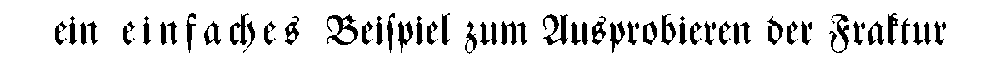

{:pdf: type="application/pdf"}

- [Besonderheiten der Fraktur](#Einleitung)
- [Warum LaTeX?](#LaTeX)
- [Verfügbare Pakete](#Pakete)

## Besonderheiten der Fraktur ##
{: #Einleitung}

Wer Texte auf dem Rechner in Fraktur setzen will, stößt
schnell auf gewisse Schwierigkeiten. Absolute Grundvoraussetzung
für Fraktursatz ist die korrekte Verwendung von langem s
(&raquo;&#383;&laquo;) und rundem s (&raquo;s&laquo;).  Bei vielen
frei erhältlichen Schriften (Fonts) ist allerdings das lange s
nicht einmal im Zeichenvorrat enthalten. Es gibt zum Glück
inzwischen zahlreiche hochwertige Fonts, die darüber hinaus auch
eine Vielzahl an Ligaturen bereitstellen.

Die große Anzahl zusätzlicher Zeichen führt
allerdings dazu, dass diese Fonts oft nur mithilfe eines
Konvertierungsprogramms sinnvoll verwendet werden können, da die
Zeichensatzbelegung teilweise stark von der normalen Belegung abweicht
(so kann z.&nbsp;B. an der Stelle des Buchstabens &raquo;c&laquo; die
viel häufiger benötigte Ligatur &raquo;ch&laquo;
liegen). Auch eine Umstellung auf Schriften anderer Hersteller (mit
typischerweise anderer Zeichensatzbelegung) wird so erschwert.

Diese Probleme können durch die Verwendung von LaTeX in Kombination
mit den unten beschriebenen Paketen umgangen werden.

Hier ein einfaches Beispiel (verwendet wurde das frakturx-Paket
mit der Zentenar-Fraktur):

Der Quelltext zur Erzeugung dieses Beispiels ist:

    ein \textspa{einfaches} Beispiel zum Aus+probieren der Fraktur

Die verschiedenen s-Buchstaben sowie Ligaturen werden weitgehend
automatisch gesetzt, auch korrekter Sperrsatz wird erleichtert.

Ein etwas längerer Text in der Alten Schwabacher:
[Ein Schildbürgerstreich](Die_Schildbuerger_bauen_ein_Rathaus_a5.pdf){:pdf} (PDF, 38 KB)

Weitere Beispiele:
-   [E-Books in Fraktur](ebooks.html)
-   Noten in Fraktur (gesetzt mit GNU LilyPond):
    * [Nun ruhen alle Wälder](/musik/noten/nun_ruhen.pdf){:pdf} (PDF, 32 KB)
    * [O Welt, sieh hier dein Leben](/musik/noten/o_welt.pdf){:pdf} (PDF, 32 KB)

## Warum LaTeX? ##
{: #LaTeX}

LaTeX ist ein sehr mächtiges Schriftsatzsystem mit vielen
Stärken.

Einige allgemeine Vorteile sind:

- LaTeX ist kostenlos für praktisch alle
  Plattformen verfügbar,
- LaTeX liefert erstklassige typographische Ergebnisse
  (ohne umfassende Kenntnisse seitens des Anwenders vorauszusetzen),
  wie z.&nbsp;B. sehr ausgeglichenen Zeilen- und Seitenumbruch,
  optischen Randausgleich, usw.,
- Dokumente sind einfache Textdateien und damit sehr portabel.

Spezielle Vorteile für den Fraktursatz:

- Ligaturen werden selbständig erkannt und gesetzt,
- Lang-s und Rund-s werden in den meisten Fällen automatisch
  korrekt verwendet,
- der Quelltext ist daher weitgehend unverändert und bleibt
  leserlich: Probleme durch andere Zeichensatzbelegungen der Fonts
  werden vermieden.

Nachteile:

- neue Fonts können nicht einfach installiert werden, sie
  müssen zunächst angepasst werden. Dazu dienen die weiter
  unten genannten Pakete,
- LaTeX ist keine Textverarbeitung, sondern eher so etwas wie eine
  Programmiersprache (genauer: eine Auszeichnungssprache, wie HTML
  oder XML); die Bedienung ist am Anfang etwas gewöhnungsbedürftig;
  dies wird allerdings mehr als wettgemacht durch eine hilfsbereite
  und hochmotivierte &raquo;Community&laquo; von LaTeX-Benutzern.

Ein guter Startpunkt für Informationen zu LaTeX ist die
[Hilfeseite (DE-TeX-FAQ)](http://www.dante.de/faq/de-tex-faq/html/de-tex-faq.html)
der deutschen Anwendervereinigung [DANTE](http://www.dante.de/).

## Verfügbare Pakete ##
{: #Pakete}

Für eine Einbindung neuer Schriften in LaTeX genügt nicht
einfach eine ttf-Datei; es werden auch so genannte Fontmetriken und
weitere Dateien benötigt. Diese &raquo;Pakete&laquo;
zusätzlicher Dateien werden auch als
&raquo;Schriftanpassungen&laquo; bezeichnet. Sie müssen für
jede Schriftart einzeln erzeugt werden, was nicht ganz einfach ist.
Aber zum Glück gibt es schon fertige Pakete, die Anpassungen
für verschiedene Fonts zur Verfügung stellen:

- frakturx
   
  Dieses Paket ist eine Weiterentwicklung des fraktur-Pakets
  (siehe nächster Punkt). Es ist leicht zu installieren, und umfasst
  eine wachsende Auswahl von Schriftarten.
   
  _Quelle:_ [www.gaehrken.de/fraktur](http://www.gaehrken.de/fraktur/)

- fraktur
   
  Dieses Paket liefert Anpassungen für einige kostenlose Fonts,
  sowie für eine Reihe kommerzieller Fonts von Delbanco. 
  Allerdings kann es bei der Verwendung mit pdfLaTeX unter Umständen
  zu Problemen mit einigen Adobe-Schriftarten (Times, Helvetica, Palatino,
  Courier) kommen.
   
  _Quelle:_ [user.uni-frankfurt.de/~muehlich/tex/texindex.html](http://user.uni-frankfurt.de/~muehlich/tex/texindex.html)

- yfonts / oldgerm
   
  Diese Pakete dienen zur Einbindung der so genannten gothic-Fonts.
  Diese enthalten eine Textur, eine Schwabacher, eine Fraktur
  sowie Zierinitialen, und sind bei vielen LaTeX-Distributionen bereits
  enthalten, eine Installation entfällt somit.
  Dieselben Schriften können allerdings weitaus
  komfortabler mit dem Paket frakturx verwendet werden.
   
  _Quelle:_ [www.ctan.org](http://www.ctan.org/)

Weitere allgemeine Informationen zum Fraktursatz, Beispieltexte und
detailliertere Vergleiche der verschiedenen Pakete finden sich bei den
Dokumentationen zu den Paketen fraktur und frakturx.
